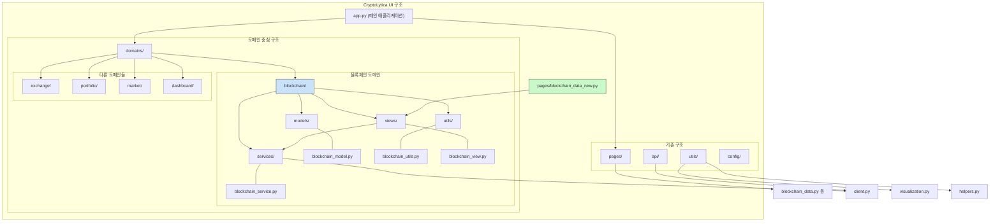
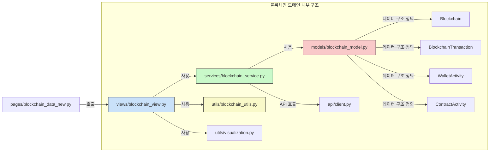
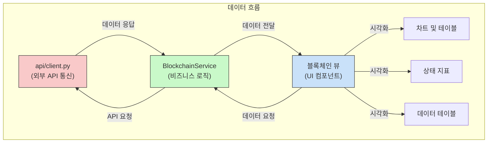

# 도메인 중심 구조 시각화

이 문서는 CryptoLytica UI 프로젝트의 도메인 중심 구조를 Mermaid 다이어그램으로 시각화합니다.

## 프로젝트 전체 구조

```mermaid
graph TD
    subgraph "CryptoLytica UI 구조"
        App["app.py (메인 애플리케이션)"]
        
        subgraph "도메인 중심 구조"
            Domains["domains/"]
            
            subgraph "블록체인 도메인"
                BlockchainDomain["blockchain/"]
                
                BCModels["models/"]
                BCServices["services/"]
                BCUtils["utils/"]
                BCViews["views/"]
                
                BCModels --- BlockchainModel["blockchain_model.py"]
                BCServices --- BlockchainService["blockchain_service.py"]
                BCUtils --- BlockchainUtils["blockchain_utils.py"]
                BCViews --- BlockchainView["blockchain_view.py"]
            end
            
            subgraph "다른 도메인들"
                Exchange["exchange/"]
                Portfolio["portfolio/"]
                Market["market/"]
                Dashboard["dashboard/"]
            end
        end
        
        subgraph "기존 구조"
            Pages["pages/"]
            API["api/"]
            Utils["utils/"]
            Config["config/"]
        end
        
        NewPages["pages/blockchain_data_new.py"]
    end
    
    App --> Pages
    App --> Domains
    Pages --> OldPages["blockchain_data.py 등"]
    
    Domains --> BlockchainDomain
    Domains --> Exchange
    Domains --> Portfolio
    Domains --> Market
    Domains --> Dashboard
    
    BlockchainDomain --> BCModels
    BlockchainDomain --> BCServices
    BlockchainDomain --> BCUtils
    BlockchainDomain --> BCViews
    
    NewPages --> BCViews
    
    API --> APIClient["client.py"]
    Utils --> UtilsVis["visualization.py"]
    Utils --> UtilsHelpers["helpers.py"]
    
    BCServices --> APIClient
    BCViews --> BCServices
    
    style BlockchainDomain fill:#c9e1f9,stroke:#333
    style NewPages fill:#c9f9c9,stroke:#333
```

## 블록체인 도메인 내부 구조

```mermaid
graph LR
    subgraph "블록체인 도메인 내부 구조"
        View["views/blockchain_view.py"]
        Service["services/blockchain_service.py"]
        Model["models/blockchain_model.py"]
        Utils["utils/blockchain_utils.py"]
        
        Model --> |"데이터 구조 정의"| Blockchain["Blockchain"]
        Model --> |"데이터 구조 정의"| BCTransaction["BlockchainTransaction"]
        Model --> |"데이터 구조 정의"| WalletActivity["WalletActivity"]
        Model --> |"데이터 구조 정의"| ContractActivity["ContractActivity"]
        
        Service --> |"사용"| Model
        Service --> |"API 호출"| APIClient["api/client.py"]
        
        View --> |"사용"| Service
        View --> |"사용"| SharedUtils["utils/visualization.py"]
        View --> |"사용"| Utils
    end
    
    Page["pages/blockchain_data_new.py"] --> |"호출"| View
    
    style Model fill:#f9c9c9,stroke:#333
    style Service fill:#c9f9c9,stroke:#333
    style View fill:#c9e1f9,stroke:#333
    style Utils fill:#f9f9c9,stroke:#333
```

## 데이터 흐름

```mermaid
graph TD
    subgraph "데이터 흐름"
        APIClient["api/client.py\n(외부 API 통신)"]
        Service["BlockchainService\n(비즈니스 로직)"]
        View["블록체인 뷰\n(UI 컴포넌트)"]
        
        APIClient --> |"데이터 응답"| Service
        Service --> |"데이터 전달"| View
        View --> |"데이터 요청"| Service
        Service --> |"API 요청"| APIClient
        
        View --> |"시각화"| Charts["차트 및 테이블"]
        View --> |"시각화"| Metrics["상태 지표"]
        View --> |"시각화"| Tables["데이터 테이블"]
    end
    
    style APIClient fill:#f9c9c9,stroke:#333
    style Service fill:#c9f9c9,stroke:#333
    style View fill:#c9e1f9,stroke:#333
```

## 마이그레이션 프로세스

```mermaid
graph TD
    subgraph "마이그레이션 프로세스"
        IdentifyDomain["1. 도메인 식별"]
        CreateStructure["2. 도메인 구조 생성"]
        SeparateModels["3. 데이터 모델 분리"]
        SeparateServices["4. 서비스 레이어 분리"]
        SeparateUtils["5. 유틸리티 함수 분리"]
        SeparateViews["6. 뷰 레이어 분리"]
        CreateNewPage["7. 새 페이지 생성"]
        TestAndVerify["8. 테스트 및 검증"]
        
        IdentifyDomain --> CreateStructure
        CreateStructure --> SeparateModels
        SeparateModels --> SeparateServices
        SeparateServices --> SeparateUtils
        SeparateUtils --> SeparateViews
        SeparateViews --> CreateNewPage
        CreateNewPage --> TestAndVerify
    end
    
    style IdentifyDomain fill:#f9c9c9,stroke:#333
    style CreateStructure fill:#c9f9c9,stroke:#333
    style SeparateModels fill:#c9e1f9,stroke:#333
    style SeparateServices fill:#f9f9c9,stroke:#333
    style SeparateViews fill:#f9c9e1,stroke:#333
    style TestAndVerify fill:#c9f9e1,stroke:#333
``` 